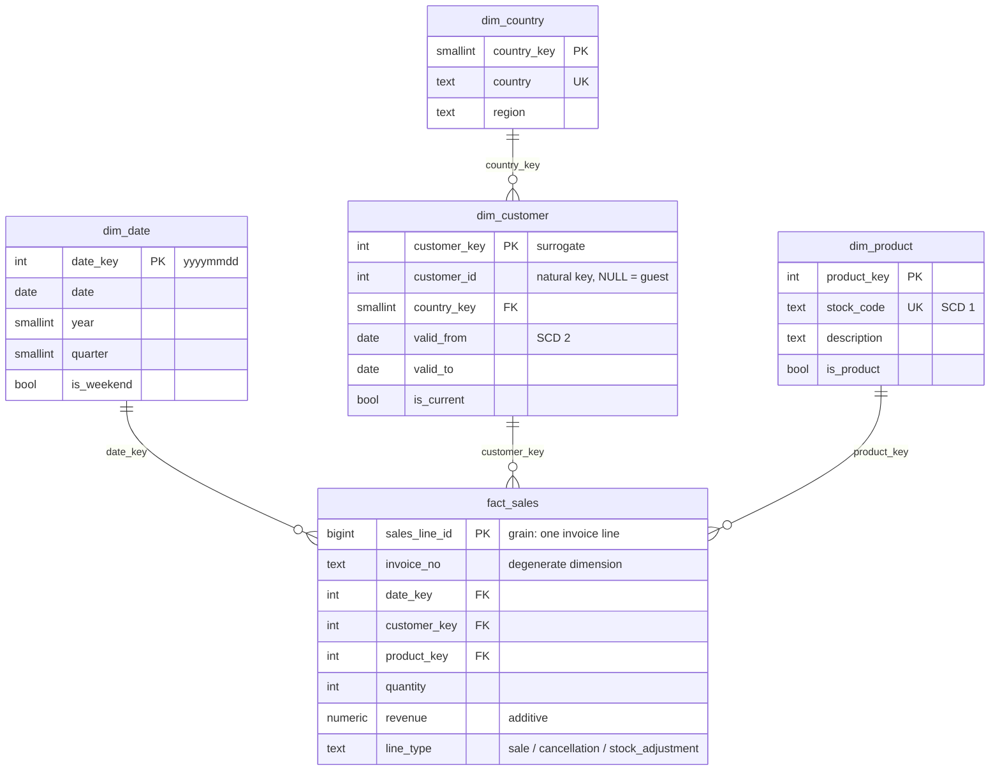

# 02 · Data modeling: an e-commerce star schema

*Plan days 22–28: star schemas, facts and dimensions, slowly changing dimensions, Snowflake.*

A dimensional model for a real online retailer (UCI Online Retail II: 1M invoice lines, 2009–2011). It is the schema that [Project 1](../03-project-1-ingestion) loads and [the dbt project](../04-dbt-analytics) rebuilds.



## Design decisions
| Decision | Choice | Why |
|---|---|---|
| Grain | one invoice line | the finest grain the source has; any coarser total can be computed from it, never the reverse |
| Customer history | **SCD type 2** (`valid_from`, `valid_to`, `is_current`) | 13 customers changed country (some several times); old sales must stay attributed to the old country |
| Product history | **SCD type 1** (overwrite) | 595 products have description typos and renames; their history has no analytical value |
| Guest checkouts (21% of lines) | one "guest" customer row per country | revenue by country stays complete instead of dropping a fifth of sales |
| Cancellations and stock adjustments | kept as lines, told apart by `line_type` | net revenue = `sum(revenue)`; 3,393 negative-quantity lines are stock write-offs at price 0 ("damages", "missing"), **not** cancellations: only invoices starting with C are |
| Date | generated calendar dimension, `yyyymmdd` key | days without sales exist; weekday/weekend attributes live in one place |
| Country | snowflaked out of the customer dimension | the region rule is defined once; SCD 2 versions only store a small key |

## Files
```
sql/01_schema.sql           PostgreSQL DDL: schemas raw/dw/audit, dimensions, fact, constraints, indexes
sql/02_seed_dimensions.sql  generated calendar + the region rule (dw.region_of)
sql/03_scd2_merge.sql       set-based SCD 2 merge (expire, same-day correction, insert), idempotent
sql/04_example_queries.sql  ROLLUP by region/quarter, historical vs current attribution, point-in-time lookup
snowflake/                  the same model in Snowflake SQL + SCD 2 with MERGE (reference, not executed)
tests/test_schema.py        runs the DDL and the SCD 2 merge on a real Postgres: history, idempotency, constraints
```

## Run the tests
```bash
python ../scripts/local_postgres.py start      # or: docker compose up -d in 03-project-1-ingestion
```
```bash
PG_DSN=postgresql://de:de@localhost:5435/de pytest
```

See [LEARN.md](LEARN.md) for the concepts and exercises.
