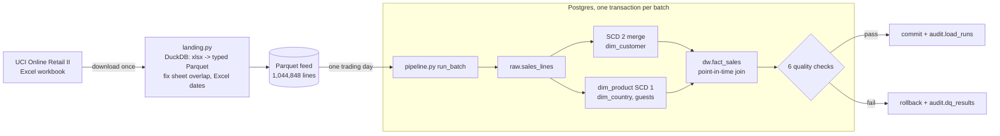

# 03 · Project 1: e-commerce ingestion pipeline

*Plan days 29–35, mini project 1: Python ingests a public dataset into Postgres in Docker, modeled as a star schema.*

A daily batch pipeline that replays two years of a real online retailer's sales (UCI Online Retail II, 1.04M invoice lines) **one trading day at a time** into the star schema designed in [02-data-modeling](../02-data-modeling). Every batch is transactional, idempotent, audited and quality-checked.



## Results of a full backfill
| | |
|---|---|
| Trading days loaded | 604 (1 Dec 2009 – 9 Dec 2011), every batch passing its 6 checks |
| Raw lines → facts | 1,044,848 → 1,044,843 + **5 rejected** (zero quantity, or the source's negative "Adjust bad debt" price) |
| Net revenue in the fact | £19,068,438.24: 1,022,285 sale lines, 19,165 cancellation lines (−£1.47M), 3,393 stock adjustments (£0) |
| Customers | 5,942, of which **13 changed country** (customer 12422 switched between Australia and Switzerland 6 times) → 5,973 SCD 2 versions |
| Guest checkouts | 15 guest members, one per country |
| Run time | about 90 s for the whole backfill, 0.1–0.2 s per day |

## What it demonstrates
- **Batch semantics:** each run owns one `batch_date`; it deletes and re-inserts only its own data. **Re-running any day, even after later days, gives identical results.** A test proves it.
- **SCD 2 with point-in-time joins:** each sale is attached to the customer version valid *on the sale's date*.
- **Data contracts in SQL:** every raw line is loaded or explicitly rejected, revenue reconciles to the penny, there's one current version per customer, versions never overlap, and sales have a positive quantity.
- **Fail safe:** a failed check rolls the whole batch back. The run and its failed checks are still recorded in `audit.*` (written outside the rolled-back transaction).
- **Raw / warehouse / audit separation** (`raw`, `dw`, `audit` schemas), and lineage from every fact row back to its source line (`sales_line_id`).

## Run it
```bash
docker compose up --build            # Postgres + full backfill; the warehouse stays on localhost:5435
```
Without Docker (Python 3.12):
```bash
python ../scripts/local_postgres.py start && pip install -r requirements-dev.txt
```
```bash
PG_DSN=postgresql://de:de@localhost:5435/de python -m ingest.pipeline backfill
```
```bash
PG_DSN=postgresql://de:de@localhost:5435/de pytest      # 5 end-to-end tests on hand-made batches
```
Then try the queries in [`../02-data-modeling/sql/04_example_queries.sql`](../02-data-modeling/sql/04_example_queries.sql), or `SELECT * FROM audit.load_runs ORDER BY run_id DESC LIMIT 5`.

## Files
```
ingest/landing.py           download, Excel -> Parquet feed (DuckDB), in-memory daily reader
ingest/pipeline.py          setup / run / backfill, one transaction per batch, audit records
sql/00_pipeline_tables.sql  raw.sales_lines, stage, audit.load_runs, audit.dq_results
sql/10_transform_batch.sql  customer snapshot of the batch (input of the SCD 2 merge in 02)
sql/20_load_facts.sql       countries, guest members, products (SCD 1), facts (point-in-time join)
sql/30_quality_checks.sql   the 6 data-quality checks
tests/test_pipeline.py      star build, idempotent re-run, audit, rollback, a sabotaged load caught by checks
```
See [LEARN.md](LEARN.md).
