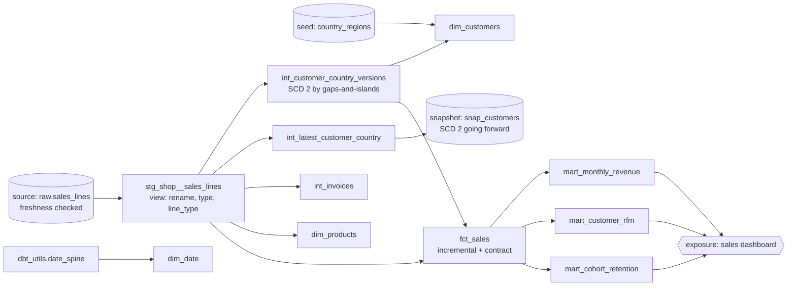

# 04 · dbt analytics on Project 1's data

*Plan days 32–42: dbt models, sources, seeds, tests, snapshots, macros, docs, incremental models.*

A dbt project that rebuilds the retail warehouse from [Project 1](../03-project-1-ingestion)'s raw layer (`raw.sales_lines`, 1.04M lines) and adds analytics marts. Its tests also **cross-check Project 1**: two independent implementations of the same model must agree, and they do (after the bug they found together, see below).



## What's in it
| dbt feature | Where |
|---|---|
| Sources + freshness | `models/staging/_shop__sources.yml` (warn after 2 days without a load) |
| Seed | `seeds/country_regions.csv` (43 countries → region, ISO code); every source country must exist in it (`relationships` test) |
| Staging / intermediate / marts layers | views for staging, tables for the rest, custom schemas `dbt_staging`, `dbt_intermediate`, `dbt_marts` |
| **Incremental model** | `fct_sales`: `delete+insert` on `sales_line_id`, re-processes the last 3 batch days (`lookback_days` var) to catch re-run batches |
| **Model contract** | `fct_sales`: column names and types enforced, primary key declared |
| Snapshot | `snap_customers` (check strategy on country) |
| Macros | `money()`, `rfm_segment()`, `generate_schema_name` override |
| Packages | `dbt_utils` (`date_spine`, `generate_surrogate_key`, `expression_is_true`, `unique_combination_of_columns`, `accepted_range`) |
| Generic tests | `unique`, `not_null`, `relationships`, `accepted_values` + a **custom generic test** `sums_match` (revenue reconciles between layers) |
| Singular tests | `assert_scd2_matches_project_1`, `assert_fact_matches_project_1` |
| **Unit tests** (dbt 1.8+) | SCD 2 version logic on 5 hand-made rows; RFM scoring with tied values |
| Docs + exposure | descriptions in YAML, `dbt docs generate`, a `sales_dashboard` exposure in the lineage graph |
| Analysis | `analyses/top_products_by_region.sql` (compiled, never materialized) |

`dbt build` runs **57 nodes: 56 pass**, plus 1 no-op (the exposure).

## Results
- **Line types:** 1,022,285 sales (£20.53M), 19,165 cancellations (−£1.47M), 3,393 stock adjustments (£0). Net £19.07M, identical to Project 1 to the penny (`assert_fact_matches_project_1`).
- **SCD 2:** the 5,973 customer versions rebuilt here with window functions match Project 1's incremental merge row for row (`assert_scd2_matches_project_1`).
- **RFM:** Champions are 21.6% of customers and 69.2% of net revenue; 27.7% are "Lost".
- **Regions:** the UK is £16.2M of the £19.07M net revenue, the rest of Europe £2.58M.

**The bug the tests found.** The two projects first disagreed on what a cancellation is. Project 1 used "negative quantity", dbt used "invoice starts with C". The dbt test flagged 3,394 conflicting lines, and 3,393 of them turned out to be **stock adjustments** (damages, write-offs at price 0). Both projects now use a three-way `line_type`, and the story is told in [03's LEARN.md](../03-project-1-ingestion/LEARN.md).

## Run it
Project 1's warehouse must be loaded first (`docker compose up` in `03-project-1-ingestion`). Then:
```bash
docker compose run --rm dbt                         # dbt build
```
Or locally (Python 3.12):
```bash
pip install -r requirements.txt && dbt deps --profiles-dir .
```
```bash
dbt build --profiles-dir .
```
```bash
dbt docs generate --profiles-dir . && dbt docs serve --profiles-dir .     # lineage graph in the browser
```
Connection settings come from `PG_HOST`, `PG_PORT`, `PG_USER`, `PG_PASSWORD` and `PG_DB` (defaults: localhost:5435, de/de).

See [LEARN.md](LEARN.md).
