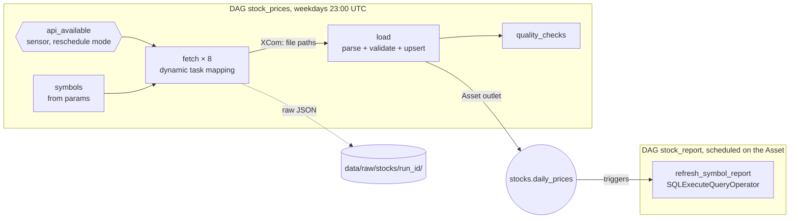

# 05 · Airflow stock-market pipeline

*Plan days 41–49: Airflow architecture, DAGs, operators, sensors, XComs, scheduling, the course's stock market project.*

Two Airflow 3 DAGs that load daily prices for 8 US and French stocks into a Postgres warehouse and refresh a per-symbol report whenever new prices land.



## What it demonstrates
| Airflow concept | In this project |
|---|---|
| TaskFlow API (Airflow 3, `airflow.sdk`) | `@dag`, `@task`, return values passed as XComs |
| Sensor | `@task.sensor(mode="reschedule")` waits for the API without holding a worker slot |
| Dynamic task mapping | `fetch.expand(symbol=symbols())`: one task per symbol, decided at run time; `max_active_tis_per_dagrun=3` limits API pressure |
| XComs | small values only (file paths, row counts); the data goes through files and the database |
| Retries | 3 retries with exponential backoff, `dagrun_timeout`, `max_active_runs=1` |
| Params | `symbols` and `lookback_days`, editable when triggering a run (a 2-year backfill is just `lookback_days=730`) |
| Connections | the `warehouse` connection comes from the `AIRFLOW_CONN_WAREHOUSE` env var, so no credentials live in code |
| **Data-aware scheduling** | `load` declares an Asset outlet; `stock_report` is scheduled on that Asset instead of a cron |
| Operators | `SQLExecuteQueryOperator` with a templated SQL file (`template_searchpath`) |

**Idempotent by design.** Each run re-fetches the last *N* days and upserts them, so a failed day heals on the next run and price corrections overwrite old values. There's no `catchup`: history is loaded with a bigger `lookback_days`, not with hundreds of runs.

The pipeline logic (`include/stock_pipeline/prices.py`) is plain Python, unit-tested without Airflow. The DAG files only wire it into tasks.

## Run it
```bash
docker compose up -d                 # Postgres, then airflow db migrate, API server, scheduler, DAG processor
```
Open http://localhost:8080 (local dev mode, no login). `stock_prices` is unpaused. To load two years of history, trigger it with the params `{"lookback_days": 730}`. Then query the warehouse:
```bash
psql postgresql://de:de@localhost:5435/warehouse -c "SELECT * FROM stocks.symbol_report ORDER BY return_pct DESC"
```
Tests (no Airflow needed):
```bash
PG_DSN=postgresql://de:de@localhost:5435/de pytest       # parsing, validation, idempotent upsert, checks, report SQL
```

> The price source is Yahoo Finance's public chart endpoint: free and keyless, but **unofficial** (it can change or rate-limit). The sensor, retries and validation exist for exactly that kind of source.

See [LEARN.md](LEARN.md).
