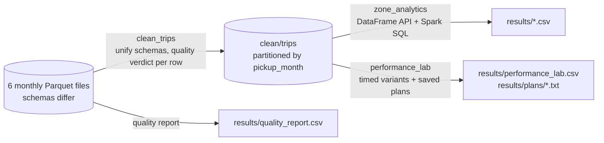

# 06 · PySpark: six months of NYC taxi trips

*Plan days 50–58: PySpark DataFrames, Spark SQL, partitioning, performance.*

Spark 4.2 jobs on the NYC Taxi & Limousine Commission's yellow-taxi trips for January–June 2024 (six monthly Parquet files, about 300 MB): clean them into a month-partitioned dataset, analyze them with both the DataFrame API and Spark SQL, and run a **performance lab** that measures what partitioning, join strategies, AQE, skew handling and caching actually change.



## What it demonstrates
| Topic | Where |
|---|---|
| Messy multi-file input | `transforms.unify`: the monthly files disagree on column case and types; every file is cast to one schema before the union |
| One verdict per row | `quality_verdict`: the first failing rule wins, so every rejected trip is explained (`results/quality_report.csv`) |
| Partitioned output | `partitionBy("pickup_month")` with one file per partition (`repartition` by the same column first) |
| Broadcast join | the 265-row zone table is broadcast, so the 20M-row side is never shuffled |
| Window functions | top 3 zones per borough per month, with a deterministic tiebreak |
| Spark SQL | the same questions in SQL on temp views, with month-over-month growth via `lag()` |
| Performance lab | partition pruning, sort-merge vs broadcast join, AQE partition coalescing, salting a skewed key, caching; each variant is timed and its physical plan saved |
| Tests | 7 pytest tests of the pure transformations on tiny DataFrames (local SparkSession) |

## Run it
```bash
docker compose build
```
```bash
docker compose run --rm spark python -m jobs.download
```
```bash
docker compose run --rm spark sh -c "python -m jobs.clean_trips && python -m jobs.zone_analytics && python -m jobs.performance_lab"
```
```bash
docker compose run --rm spark pytest -q
```
The Spark UI of a running job is on http://localhost:4040. A standalone cluster (1 master + 2 workers) is available with `docker compose --profile cluster up -d` (UI on http://localhost:8081).

See [LEARN.md](LEARN.md).
