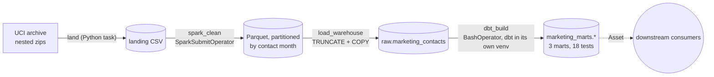

# 07 · Project 2: Airflow orchestrates Spark and dbt on marketing data

*Plan days 59–63, mini project 2: Airflow orchestrates a Spark job and dbt models on marketing data.*

A weekly pipeline on the real **UCI Bank Marketing** dataset (41,188 phone calls of a Portuguese bank's term-deposit campaigns, May 2008 – Nov 2010). Each step uses the right tool: Python downloads, **Spark** cleans and partitions, Postgres stores, **dbt** models and tests, and **Airflow** orders, retries and monitors everything.



## The data problem Spark solves
The file has a month name but **no year**. Rows are in date order, though, so the Spark job numbers the rows in file order and adds a year each time the month number goes *down* (December → March). The result matches the documentation exactly: the first contact is in 2008-05, the last in 2010-11, across 26 distinct months. The job also turns the `pdays = 999` sentinel ("never contacted before") into a proper NULL plus a boolean, and refuses to write output if any of its 5 quality rules fails.

## Findings (dbt marts)
| | |
|---|---|
| **Calling more doesn't help** | conversion is 13.0% after one call in a campaign, and falls with every extra call to 3.6% at 10+ calls (`mart_contact_fatigue`) |
| **Past success predicts success** | customers who said yes in a previous campaign convert at **65.1%, a lift of 5.8×** (`mart_segment_lift`) |
| Segments | ages 65+ (lift 4.2), students (2.8) and retirees (2.2) convert best; blue-collar (0.61) and landline contacts (0.46) worst |
| Channel | mobile 14.7% vs landline 5.2% |
| Strategy shift | 2008: ~7,000 calls a month at 3–6% conversion. 2010: ~200 calls a month at ~50%. The bank moved from mass calling to targeting. Monthly conversion correlates at **−0.55** with the 3-month EURIBOR rate. |

`duration` (call length) is deliberately dropped in staging: it's only known after the call and nearly determines the outcome, so using it would be **target leakage**.

## Run it
```bash
docker compose up -d --build        # custom Airflow image: + Java 17, PySpark, Spark provider, dbt venv
```
Open http://localhost:8080 and trigger `marketing_pipeline`. The marts land in `postgresql://de:de@localhost:5435/warehouse`, schema `marketing_marts`.

Tests:
```bash
PG_DSN=postgresql://de:de@localhost:5435/de pytest            # load test (Spark tests skip without Java 17)
```
```bash
docker compose run --rm airflow-scheduler python -m pytest /opt/airflow/tests    # everything, Spark included
```

See [LEARN.md](LEARN.md).
