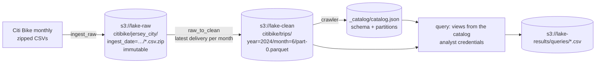

# 08 · Data lake: S3 zones, a Glue-style job, a catalog, Athena-style queries

*Plan days 64–70: S3, Glue, Athena, IAM (Lambda, Kinesis and Redshift are covered in LEARN.md).*

The core AWS data-lake pattern, built with free local stand-ins and the same S3 API, on 12 months of real **Citi Bike Jersey City** trips (1.05M rides, 2024):

| AWS service | Role | Here |
|---|---|---|
| S3 | object storage, raw / clean / results zones | **SeaweedFS** (S3 API) in Docker, **moto** in the tests |
| Lambda / scheduled job | copy source files into the raw zone | `lake/ingest_raw.py` |
| Glue job | raw CSV → typed, validated, partitioned Parquet | `lake/raw_to_clean.py` (DuckDB) |
| Glue crawler + Data Catalog | infer schemas and partitions, publish table definitions | `lake/crawler.py` → `s3://lake-clean/_catalog/catalog.json` |
| Athena | SQL over S3 through the catalog | `lake/query.py` (DuckDB `httpfs`) + `sql/queries.sql` |
| IAM | least-privilege identities | a `pipeline` writer and a read-only `analyst` (`docker/s3.json`; the AWS IAM policy equivalents are in `iam/`) |



## Results (12 months, 2024)
- **1,052,105 raw → 1,051,966 clean rides.** The job drops rides that end before they start, last over 24 h, belong to another month, or repeat a ride id.
- **Seasonality:** 50,635 rides in January vs 118,268 in October. Members are 84% of January riders but 71% in June: casual riders come with the summer.
- **Commuter city:** weekday peaks at 17:00–18:00 (and 08:00), weekend peaks at midday. The two Hoboken Terminal stations and Grove St PATH, all train hubs, are the busiest. Under 2% of rides there are round trips.
- **Partition pruning:** the summer query (`month IN (7, 8)`) reads only 2 of the 12 Parquet files. Members ride 8.4 minutes on average, casual riders 18.4.

## What it demonstrates
- **Zones:** raw is immutable and partitioned by *ingestion date*. Clean is query-optimized and partitioned by *event date*. Results are disposable.
- **Re-processing:** the Glue-style job picks the **latest delivery** of each month and overwrites exactly that month's partition, so re-running is idempotent and corrections are just new deliveries.
- **A catalog** separates "where the data is" from "how to query it". The query layer only reads `catalog.json`.
- **Least privilege:** the analyst can read the clean zone and write results, but can't list raw data or modify clean data. `lake.check_permissions` proves it against the S3 server.
- **One codebase, three backends:** SeaweedFS, moto and real AWS differ only by `S3_ENDPOINT` and credentials.

## Run it
```bash
docker compose up -d s3 && docker compose run --rm lake python -m lake.setup_buckets
```
```bash
docker compose run --rm lake sh -c "python -m lake.ingest_raw && python -m lake.raw_to_clean && python -m lake.crawler && python -m lake.query"
```
```bash
docker compose run --rm lake python -m lake.check_permissions       # 2 allowed, 3 denied, as designed
```
Tests (no Docker, an in-process moto S3):
```bash
pip install -r requirements-dev.txt && pytest
```

See [LEARN.md](LEARN.md).
