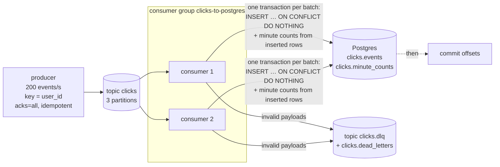

# 09 · Kafka streaming: click events → Kafka → Postgres

*Plan days 73–77: Kafka topics, producers, consumers, streaming basics.*

A producer generates a realistic, messy clickstream for an online shop. Kafka buffers it in a 3-partition topic, and a **consumer group** of two consumers writes it to Postgres with **exactly-once results**, a **dead-letter queue** and per-minute aggregates.



## The messy stream (on purpose)
The generator sends sessions of page views, product views, add-to-carts and purchases, plus what real streams contain:
- **duplicates** (~1%, as from upstream retries);
- **late events** (~2%, event time 2–30 minutes in the past, as from a phone that was offline);
- **malformed payloads** (~0.2%).

## How "exactly-once" is achieved
Kafka delivers **at least once**: offsets are committed only *after* the database transaction, so a crash replays the last batch. The sink makes the *result* exactly-once:
1. `INSERT … ON CONFLICT (event_id) DO NOTHING RETURNING …`: duplicates and replays insert nothing.
2. The per-minute counts are incremented **only from the rows actually inserted**, in the same transaction, so aggregates never double either.
3. Invalid messages never block the partition. They go to `clicks.dlq` with the error in a header, and to `clicks.dead_letters`.

The test `test_sink_is_exactly_once_under_duplicates_and_replays` sends 1,000 messages with 5% duplicates and 1% malformed, then **replays the whole batch**. Events stored = sum of minute counts = unique valid events, and revenue matches to the cent.

Aggregates use **event time** (when the click happened), not processing time, so a late event increments the minute it belongs to.

## Run it
```bash
docker compose up -d --build              # Kafka, topics, Postgres, producer, 2 consumers, Kafka UI on :8082
```
```bash
docker compose logs -f consumer consumer-2      # each consumer owns some of the 3 partitions
```
```bash
docker compose stop consumer-2                  # rebalancing: consumer 1 takes over all partitions
```
Tests (no broker needed: the sink is tested directly against Postgres):
```bash
PG_DSN=postgresql://de:de@localhost:5435/de pytest
```

See [LEARN.md](LEARN.md).
