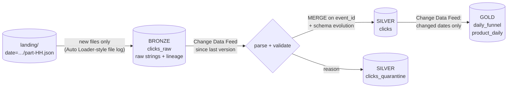

# 10 · Medallion architecture with Delta Lake

*Plan days 78–84: Databricks, Delta Lake, medallion architecture (with [Terraform](../infra) and [CI/CD](../.github/workflows/ci.yml) for the rest of the week).*

Bronze → silver → gold on Spark 4.2 + Delta Lake 4.4, the open-source table format Databricks is built on. The source is a daily export of click events produced by [project 09](../09-kafka-streaming)'s generator, so it contains duplicates, late events and malformed lines. On day 3 the source **starts sending a new field** without warning.



## What it demonstrates
| Delta / Databricks concept | Here |
|---|---|
| Medallion layers | bronze keeps every line as received (even malformed ones); silver is parsed, typed and de-duplicated; gold holds the business tables |
| Incremental ingestion | bronze records the files it has processed, like Auto Loader's checkpoint, so re-runs ingest nothing twice |
| **Change Data Feed** | silver reads only the bronze rows added since its last run, and gold only the dates silver changed |
| **MERGE** | silver upserts on `event_id`: duplicates and re-deliveries insert nothing |
| **Schema evolution** | a field the source starts sending (`device`, day 3) becomes a silver column automatically (`MERGE … withSchemaEvolution()`) |
| **Schema enforcement** | writing a wrong type into silver is refused (tested) |
| Quarantine | invalid lines go to a table with the rejection reason, never silently dropped |
| `replaceWhere` | gold recomputes only the affected dates and overwrites just those, atomically |
| Time travel, `OPTIMIZE`/`ZORDER`, `VACUUM` | `medallion/time_travel.py` |

## Run it
```bash
docker compose build
```
```bash
docker compose run --rm delta python -m medallion.run_all        # 3 days: land -> bronze -> silver -> gold, then a no-op re-run
```
```bash
docker compose run --rm delta python -m medallion.time_travel    # history, time travel, OPTIMIZE ZORDER, VACUUM
```
```bash
docker compose run --rm delta pytest -q
```

See [LEARN.md](LEARN.md).
