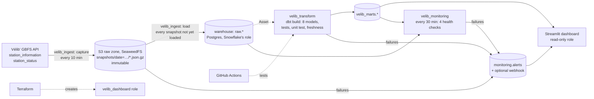

# 11 · Final project: Vélib' Paris, live bike availability pipeline

*Plan days 85–98: API → Airflow → S3 → warehouse → dbt → dashboard, Terraform infra, GitHub Actions CI, data-quality tests, monitoring and alerts.*

An end-to-end pipeline on **live open data from Vélib' Métropole**, the Paris bike-share network (~1,500 stations, ~17,000 bikes available at a time). Every 10 minutes it snapshots the whole network, keeps every snapshot in an S3 raw zone, loads a warehouse, models it with dbt, checks its own health, and serves a live dashboard.



| Plan requirement | Here | Stand-in for |
|---|---|---|
| API | Vélib' Métropole GBFS feeds (open data, no key) | |
| Airflow | 3 DAGs: ingest (*/10 min), transform (on the Asset), monitoring (*/30 min) | MWAA / Astronomer |
| S3 | SeaweedFS raw zone, gzipped JSON partitioned by date | AWS S3 |
| Snowflake | Postgres `warehouse` database (`raw`, `velib_staging`, `velib_marts`, `monitoring`) | Snowflake |
| dbt | staging → incremental fact → 5 marts, tests, a unit test, source freshness | dbt Cloud |
| Dashboard | Streamlit + pydeck map + Altair charts | Tableau / Looker / Metabase |
| Terraform | read-only `velib_dashboard` role, reusing the module from [`../infra`](../infra) | |
| CI | the repository's [GitHub Actions workflow](../.github/workflows/ci.yml) runs this project's tests | |

## Data quality, monitoring and alerts
- **At extraction:** a snapshot is refused if a feed is empty, has under 1,000 stations, or over 5% of status rows reference unknown stations.
- **At load:** primary keys, CHECK constraints (no negative counts), and an idempotent load log, so re-runs load nothing twice and missed runs catch up.
- **In dbt:** uniqueness, `not_null`, relationships, ranges, source freshness (warn after 30 min, error after 2 h), a unit test for the empty-episode logic, and a capacity check at *warn* severity, because the feed itself is sometimes inconsistent.
- **Monitoring DAG:** freshness, completeness, "network not frozen", and capacity plausibility. Every failed check becomes an alert.
- **Failure callback:** any task that fails after its retries writes an alert. Alerts go to `monitoring.alerts` (shown on the dashboard), and to a Slack/Teams/Discord webhook if `ALERT_WEBHOOK_URL` is set.

## What the data showed while building it
- **The station code encodes the location.** Codes 1xxxx–20xxx are Paris arrondissements (`16107` → 16e), 21xxx and up are suburban communes, and **60xxx are temporary event megastations**: Invalides and Concorde, with **410 docks each**. A dbt range test (capacity ≤ 200) failed on them, which is how they were found. The area mapping was checked against station coordinates.
- 2 stations report a capacity of 0, and some snapshots report more bikes + docks than capacity. That's kept visible as a warning, not silently "fixed".
- A typical Saturday-evening snapshot: **16,704 bikes available, 36% of them e-bikes, 6.3% of stations empty, 1.7% full.**

## Run it
```bash
docker compose up -d --build                        # Postgres, S3, Airflow (3 DAGs), dashboard
```
Airflow: http://localhost:8080 · Dashboard: http://localhost:8501

Least-privilege access for the dashboard:
```bash
cd infra && terraform init && terraform apply        # TF_VAR_pg_admin_password, TF_VAR_dashboard_password
```
Collect history before the stack is up (GBFS keeps none), then upload it to the raw zone:
```bash
python scripts/collect_snapshots.py --every 300
```
Tests (no Docker: moto S3 + a local Postgres):
```bash
pip install -r requirements-dev.txt && PG_DSN=postgresql://de:de@localhost:5435/de pytest
```

## Files
```
include/velib/gbfs.py        extract + validate + flatten the two feeds
include/velib/lake.py        S3 raw zone (put, list, get, upload collected snapshots)
include/velib/warehouse.py   raw tables + idempotent load (load log, COPY, upsert of station info)
include/velib/pipeline.py    the two steps the DAGs call: capture, load_new
include/velib/monitoring.py  health checks + alert sink (table + webhook)
dags/                        velib_ingest, velib_transform (Asset-scheduled dbt), velib_monitoring
dbt/                         sources (freshness), staging, incremental fact, 5 marts, tests
dashboard/app.py             Streamlit dashboard on the marts
infra/                       Terraform: read-only dashboard role (reuses ../infra/modules)
scripts/collect_snapshots.py collect real snapshots before the stack is running
```
See [LEARN.md](LEARN.md) for the design decisions and the interview pitch.
